# Architecture Overview

**Status:** ✅ Active  
**Last Updated:** January 9, 2026  
**Maintainers:** Tech Lead, DevOps Team

---

## 🎯 System Vision

The **server-app ecosystem** is a collection of Django-based web applications serving different business domains, unified by shared infrastructure and common libraries.

## 🏗️ Architectural Principles

### 1. **Multi-Repository Strategy**

Each application lives in its own repository, enabling:

- ✅ **Independent deployment** cycles
- ✅ **Team autonomy** and ownership
- ✅ **Clear boundaries** between domains
- ✅ **Faster CI/CD** (test only what changed)
- ✅ **Granular access control**

**ADR:** [ADR-0001: Multi-Repo Strategy](../adr/0001-multi-repo.md)

### 2. **Shared Libraries**

Common code is extracted into **[server-app-shared](https://github.com/Miltoneo/server-app-shared)**, a Python package containing:

- `shared.assinaturas` - Subscription management
- `shared.pagamentos` - Payment gateway integrations (Mercado Pago)
- `shared.business` - Reusable business logic base classes

**ADR:** [ADR-0002: Shared Library](../adr/0002-shared-library.md)

### 3. **Infrastructure as Code**

All infrastructure configs live in **[server-app-infrastructure](https://github.com/Miltoneo/server-app-infrastructure)**:

- Docker Compose configurations
- Nginx reverse proxy configs
- Systemd service files
- Database migration scripts
- Deployment automation

## 📊 High-Level Architecture

```mermaid
graph TB
    subgraph "External Users"
        U1[Web Users]
        U2[Mobile Users]
        U3[API Clients]
    end
    
    subgraph "Load Balancer"
        LB[Nginx Reverse Proxy]
    end
    
    subgraph "Application Layer - Django Projects"
        A1[Construtora<br/>:8001]
        A2[Medicos<br/>:8002]
        A3[Emprestimos<br/>:8003]
        A4[SISU<br/>:8004]
        A5[Mais Médicos<br/>:8005]
        A6[Rotinas<br/>:8006]
        A7[Eleição<br/>:8007]
        A8[TDS IoT<br/>:8008]
    end
    
    subgraph "Shared Layer"
        SH[server-app-shared<br/>Python Package]
    end
    
    subgraph "Data Layer"
        DB1[(PostgreSQL<br/>5432)]
        DB2[(TimescaleDB<br/>5443)]
        CACHE[Redis Cache<br/>6379]
    end
    
    subgraph "External Services"
        MP[Mercado Pago API]
        SMTP[Email SMTP]
        MQTT[MQTT Broker]
    end
    
    U1 --> LB
    U2 --> LB
    U3 --> LB
    
    LB --> A1
    LB --> A2
    LB --> A3
    LB --> A4
    LB --> A5
    LB --> A6
    LB --> A7
    LB --> A8
    
    A1 --> SH
    A2 --> SH
    A3 --> SH
    A4 --> SH
    A5 --> SH
    A6 --> SH
    A7 --> SH
    A8 --> SH
    
    A1 --> DB1
    A2 --> DB1
    A3 --> DB1
    A4 --> DB1
    A5 --> DB1
    A6 --> DB1
    A7 --> DB1
    
    A8 --> DB2
    
    A1 --> CACHE
    A2 --> CACHE
    A3 --> CACHE
    
    A1 --> MP
    A2 --> MP
    
    A1 --> SMTP
    A2 --> SMTP
    A3 --> SMTP
    
    A8 --> MQTT
```



## 🔧 Technology Stack

### Backend

- **Framework:** Django 4.2 / 5.1 (varies by project)
- **Language:** Python 3.11+
- **ASGI Server:** Gunicorn + Uvicorn
- **Task Queue:** Celery (where needed)

### Databases

- **PostgreSQL 14+** - Primary relational database
- **TimescaleDB** - Time-series data (TDS project)
- **Redis 7+** - Caching and session storage

### Frontend

- **Template Engine:** Django Templates
- **CSS Framework:** Bootstrap 5
- **JavaScript:** Vanilla JS + Alpine.js (where needed)

### DevOps

- **Containerization:** Docker + Docker Compose
- **Reverse Proxy:** Nginx
- **Process Manager:** Systemd (production)
- **CI/CD:** GitHub Actions
- **Monitoring:** Prometheus + Grafana (planned)

**Full Stack Details:** [Technology Stack](tech-stack.md)

## 🗂️ Repository Organization

### Application Repositories

```
server-app-{project}/
├── {project}/              # Django app (models, views, business logic)
├── prj_{project}/          # Django project settings
├── docs/                   # Project-specific documentation
├── environments/           # .env files (gitignored)
├── manage.py
├── requirements.txt
├── compose.yaml            # Docker Compose for local dev
└── README.md
```

### Shared Library Repository

```
server-app-shared/
├── src/shared/             # Source code
│   ├── assinaturas/
│   ├── pagamentos/
│   └── business/
├── setup.py                # Package configuration
├── pyproject.toml          # Modern Python packaging
└── README.md
```

### Infrastructure Repository

```
server-app-infrastructure/
├── config/                 # Environment configs
├── nginx/                  # Nginx configs
├── systemd/                # Service files
├── scripts/                # Automation scripts
└── databases/              # Database schemas
```

## 🔄 Data Flow

### Typical Request Flow

1. **User Request** → Nginx (port 80/443)
2. **Nginx** → Reverse proxy to Django app (port 800X)
3. **Django App** → Processes request
4. **Django App** → Queries database (PostgreSQL/TimescaleDB)
5. **Django App** → Checks cache (Redis)
6. **Django App** → Uses shared library (server-app-shared)
7. **Django App** → Returns response
8. **Nginx** → Returns to user

**Detailed Flow:** [Data Flow Documentation](data-flow.md)

## 🔐 Security Architecture

### Multi-Tenancy

Most applications use **multi-tenant architecture** with data isolation at the **application level**:

- Each user belongs to one or more `Conta` (tenant)
- Middleware enforces tenant filtering on all queries
- Database-level constraints prevent cross-tenant data access

### Authentication

- **Custom User Model** (`CustomUser` in each project)
- **Session-based authentication** (Django sessions)
- **OAuth 2.0** for TDS project (Google OAuth via django-allauth)

### Authorization

- Django's built-in permissions system
- Custom decorators for tenant-aware authorization
- Row-level security via tenant filtering

**Full Security Guide:** [Security Guidelines](../standards/security-guidelines.md) *(coming soon)*

## 📈 Scalability Strategy

### Current State

- **Vertical Scaling:** Single server per application
- **Caching:** Redis for session and query caching
- **Database:** Single PostgreSQL instance with connection pooling

### Future Roadmap

- [ ] **Horizontal Scaling:** Multiple app instances behind load balancer
- [ ] **Database Replication:** Read replicas for heavy queries
- [ ] **Microservices:** Extract heavy workloads to separate services
- [ ] **Kubernetes:** Containerized orchestration

## 🧩 Integration Patterns

### Between Internal Apps

- **No direct communication** between applications
- **Shared database schemas** (via shared library models)
- **Event-driven** (planned: message queue)

### With External Services

- **Mercado Pago:** REST API for payment processing
- **Email:** SMTP for transactional emails
- **MQTT:** IoT device communication (TDS project)

**API Design Standards:** [API Design Guide](../standards/api-design.md) *(coming soon)*

## 📊 Monitoring & Observability

### Current

- **Logs:** Django logging to files (`django_logs/`)
- **Health Checks:** Basic HTTP endpoints
- **Metrics:** None (manual monitoring)

### Planned

- [ ] Prometheus for metrics collection
- [ ] Grafana for dashboards
- [ ] Sentry for error tracking
- [ ] ELK Stack for log aggregation

## 🔧 Development Workflow


**Detailed Workflow:** [Git Workflow](../standards/git-workflow.md) *(coming soon)*

## 📚 Related Documentation

- **[Multi-Repo Strategy](multi-repo-strategy.md)** - Why we chose multi-repo
- **[Technology Stack](tech-stack.md)** - Detailed tech choices
- **[Data Flow](data-flow.md)** - Request/response lifecycle
- **[Migration History](../migration/overview.md)** - How we got here

---

**Questions?** Open an issue on [GitHub](https://github.com/Miltoneo/server-app-docs/issues) or ask in `#dev-architecture` on Slack.
