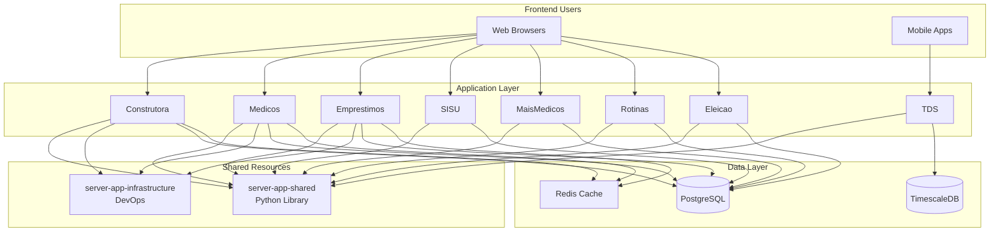

# Welcome to Server App Documentation

This is the central documentation hub for the **server-app multi-repository ecosystem**. Here you'll find everything you need to understand, develop, and deploy applications in our ecosystem.

## 🌟 What You'll Find Here

### For New Developers
- **[Getting Started Guide](guides/getting-started.md)** - Your first steps
- **[Local Setup](guides/local-setup.md)** - Set up your development environment
- **[Onboarding](processes/onboarding.md)** - Complete onboarding checklist

### For Existing Developers
- **[Architecture Overview](architecture/overview.md)** - System design
- **[Coding Standards](standards/coding-standards.md)** - Best practices
- **[Troubleshooting](guides/troubleshooting.md)** - Common issues and solutions

### For Tech Leads & Architects
- **[ADRs](adr/what-is-adr.md)** - Architecture Decision Records
- **[Multi-Repo Strategy](architecture/multi-repo-strategy.md)** - Why multi-repo?
- **[Migration Documentation](migration/overview.md)** - Full migration history

## 🗂️ Our Ecosystem

We operate **8 active projects** plus **2 shared repositories**:

### Active Projects

=== "Business Applications"
    - **[Construtora](projects/construtora.md)** - Construction project management
    - **[Medicos](projects/medicos.md)** - Medical financial management
    - **[Emprestimos](projects/emprestimos.md)** - Loan management

=== "Government Systems"
    - **[SISU](projects/sisu.md)** - SISU grades consultation
    - **[Mais Médicos](projects/maismedicos.md)** - Mais Médicos program
    - **[Eleição](projects/eleicao.md)** - Electoral data analysis

=== "Utilities"
    - **[Rotinas](projects/rotinas.md)** - Routines and procedures
    - **[TDS](projects/tds.md)** - IoT telemetry (TimescaleDB)

### Shared Resources

- **[server-app-shared](https://github.com/Miltoneo/server-app-shared)** - Python library with common code
- **[server-app-infrastructure](https://github.com/Miltoneo/server-app-infrastructure)** - DevOps and infrastructure configs

## 🚀 Quick Links

| I want to... | Go to... |
|--------------|----------|
| Start a new project | [Getting Started](guides/getting-started.md) |
| Understand the architecture | [Architecture Overview](architecture/overview.md) |
| Set up my local environment | [Local Setup](guides/local-setup.md) |
| Review coding standards | [Coding Standards](standards/coding-standards.md) |
| Deploy to production | [Deployment Process](processes/deployment.md) |
| Fix a common issue | [Troubleshooting](guides/troubleshooting.md) |

## 📊 Architecture at a Glance

## 📚 Documentation Philosophy

We follow these principles:

!!! success "Single Source of Truth"
    Each piece of information lives in exactly **one place**. Links point to the canonical source.

!!! success "Docs as Code"
    Documentation is **versioned**, **reviewed**, and **deployed** just like code.

!!! success "Proximity Principle"
    General docs here. **Project-specific docs** stay in project repos.

!!! success "Always Up to Date"
    Outdated docs are **worse than no docs**. Keep them current!

## 🤝 Contributing

Found a typo? Want to improve something? **Contributions are welcome!**

1. **Fork** the [repository](https://github.com/Miltoneo/server-app-docs)
2. **Edit** Markdown files in `docs/`
3. **Test** locally: `mkdocs serve`
4. **Submit** a Pull Request

See [CONTRIBUTING.md](https://github.com/Miltoneo/server-app-docs/blob/main/CONTRIBUTING.md) for details.

## 📞 Need Help?

- 💬 **Slack**: `#dev-docs` channel
- 📧 **Email**: dev@onkoto.com
- 🐛 **Issues**: [GitHub Issues](https://github.com/Miltoneo/server-app-docs/issues)

---

**Last Updated:** January 9, 2026  
**Maintained by:** Engineering Team
